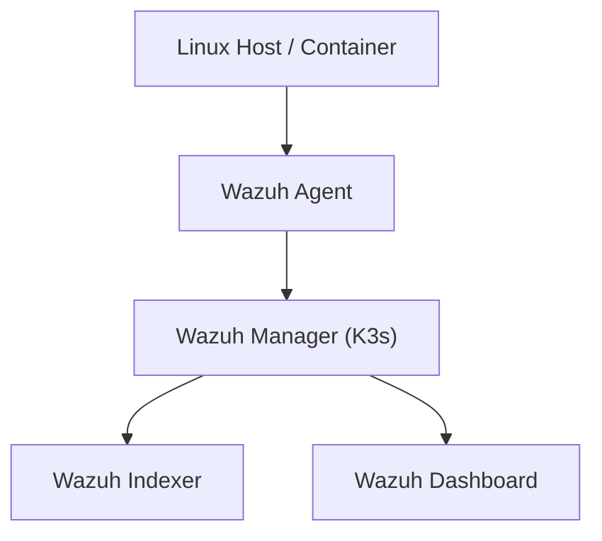

# 🛡️ Wazuh Agent Deployment Guide (Linux)

This guide documents how to correctly deploy a **Wazuh agent** on Linux systems similar to your home lab environment (e.g., Ubuntu 22.04, LXD/LXC containers, bare metal hosts), **with or without password authentication**.
It also serves as a reference for troubleshooting agent enrollment issues.

---

## 📘 Architecture Overview



---

# 🚀 1. Install Wazuh Agent (Linux)

### Add the Wazuh repository:

```bash
curl -s https://packages.wazuh.com/key/GPG-KEY-WAZUH | sudo apt-key add -
echo "deb https://packages.wazuh.com/4.x/apt/ stable main" | sudo tee /etc/apt/sources.list.d/wazuh.list
sudo apt update
```

### Install agent:

```bash
sudo apt install -y wazuh-agent
```

---

# 🧩 2. Basic Agent Configuration (No Password Auth)

Edit the agent config:

```bash
sudo nano /var/ossec/etc/ossec.conf
```

Set:

```xml
<server>
  <address>wazuh.pineserver.local</address>
  <port>1515</port>
</server>
```

Restart:

```bash
sudo systemctl restart wazuh-agent
sudo systemctl status wazuh-agent
```

Agent will attempt **unencrypted auto-enrollment**.

---

# 🔐 3. Enable Password Authentication (Recommended)

This is for environments where you want **controlled enrollment**.

## Manager-side configuration (K3s / Wazuh Manager Pod)

Exec into the manager:

```bash
sudo KUBECONFIG=/etc/rancher/k3s/k3s.yaml \
kubectl -n wazuh exec -it wazuh-manager-master-0 -- bash
```

### Create password file:

```bash
echo "WazuhPineServer123!" > /var/ossec/etc/authd.pass
chmod 640 /var/ossec/etc/authd.pass
chown root:wazuh /var/ossec/etc/authd.pass
```

### Ensure `<auth>` block is enabled:

```xml
<auth>
  <disabled>no</disabled>
  <use_password>yes</use_password>
  <ciphers>HIGH:!ADH:!EXP:!MD5:!RC4:!3DES:!CAMELLIA:@STRENGTH</ciphers>
</auth>
```

Restart manager:

```bash
/var/ossec/bin/wazuh-control restart
```

---

# 🔑 4. Configure Agent to Use Password Auth

On the agent:

```bash
sudo nano /var/ossec/etc/ossec.conf
```

Add inside `<server>`:

```xml
<auth>
  <password>WazuhPineServer123!</password>
</auth>
```

Restart agent:

```bash
sudo systemctl restart wazuh-agent
```

---

# 🤖 5. Automated Enrollment Script (No Password)

Create `auto_enroll.sh`:

```bash
#!/bin/bash
SERVER="wazuh.pineserver.local"

systemctl stop wazuh-agent
sed -i "s|<address>.*</address>|<address>$SERVER</address>|" /var/ossec/etc/ossec.conf

systemctl restart wazuh-agent
echo "[OK] Agent enrollment initiated."
```

Make executable:

```bash
chmod +x auto_enroll.sh
```

---

# 🤖 6. Automated Enrollment Script (With Password)

Create `auto_enroll_secure.sh`:

```bash
#!/bin/bash
SERVER="wazuh.pineserver.local"
PASS="WazuhPineServer123!"

systemctl stop wazuh-agent

sed -i "s|<address>.*</address>|<address>$SERVER</address>|" /var/ossec/etc/ossec.conf

cat <<EOF >> /var/ossec/etc/ossec.conf
<auth>
  <password>$PASS</password>
</auth>
EOF

systemctl restart wazuh-agent
echo "[OK] Secure agent enrollment initiated."
```

---

# 🧪 7. Testing Agent Enrollment

### Check logs:

```bash
sudo tail -f /var/ossec/logs/ossec.log
```

Successful messages include:

* `Added agent successfully`
* `Connected to server`
* `Agent key updated`

---

# 🩺 8. Troubleshooting

## ❌ *Invalid password (from manager)*

Cause: mismatch between agent `<password>` and manager `authd.pass` file.

Fix:

* Ensure no extra spaces
* Ensure password is plain text
* Restart manager after changes

---

## ❌ *Agent version must be lower or equal to manager version*

Fix: update manager deployment (K3s):

```bash
helm upgrade --namespace wazuh wazuh wazuh/wazuh
```

---

## ❌ No Internet inside LXD container

If LXD network bridge has no NAT:

```bash
lxc network set lxdbr1 ipv4.nat true
lxc restart <container>
```

---

## ❌ Manager reporting "No such tag 'users' at module 'syscollector'"

You accidentally edited the agent config on the manager pod.

Fix:

```bash
kubectl cp original ossec.conf OR
helm uninstall + reinstall
```

---

# 🧹 9. Clean Reset / Reinstall Agent

```bash
sudo systemctl stop wazuh-agent
sudo apt purge wazuh-agent -y
sudo rm -rf /var/ossec
sudo apt install wazuh-agent -y
```

---

# 📦 10. File Structure Summary

```
/var/ossec/
 ├── etc/
 │    ├── ossec.conf        # Agent config
 │    ├── client.keys       # Manager-provided key
 │    ├── authd.pass        # Manager-side enrollment password
 │
 ├── logs/ossec.log         # Main log
 └── bin/wazuh-*            # Control binaries
```

---

# 📜 License

MIT — feel free to adapt this for internal or external use.

---
