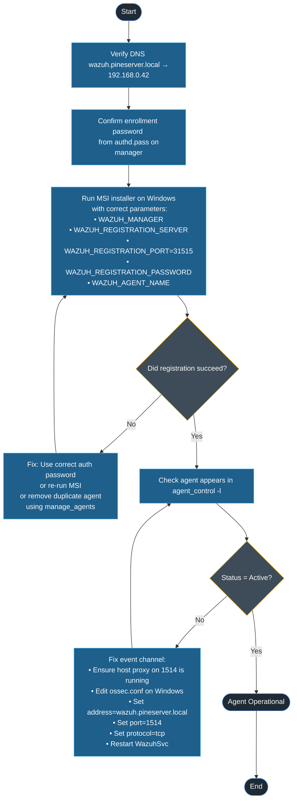
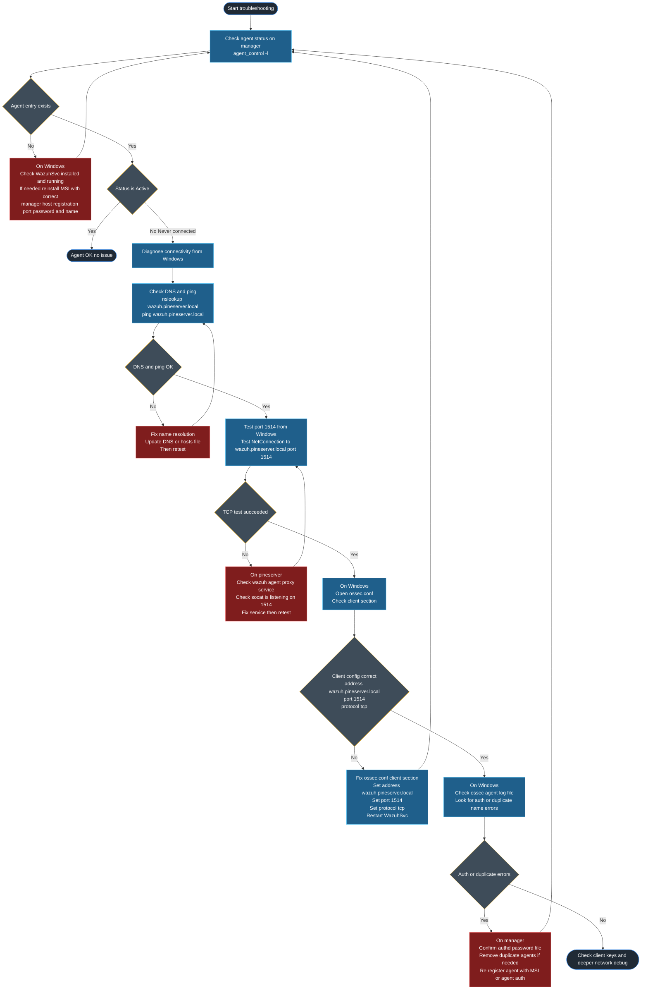

# Wazuh Agent Installation – Windows (pineserver Home Lab)

This guide documents the **exact, working process** for installing and registering Wazuh agents on Windows machines in the `pineserver` home lab environment.

It captures all the painful lessons learned, including:

- Wazuh running in **K3s** on `pineserver`
- Enrollment over **NodePort 31515/TCP**
- Agent event forwarding via a **host-level proxy on port 1514/TCP**
- Windows agents on **Wi-Fi** in the same `192.168.0.0/24` network

The goal: a **repeatable, reliable** process for new Windows endpoints.

---

## 1. Environment Overview

### 1.1 Home lab topology

- **Kubernetes:** K3s on `pineserver`
- **Node IP:** `192.168.0.42`
- **Hostname:** `pineserver`
- **Wazuh hostname (DNS):** `wazuh.pineserver.local` → `192.168.0.42`
- **Wazuh components (K8s namespace `wazuh`):**
  - `wazuh-manager-master-0`
  - `wazuh-manager-worker-0`
  - `wazuh-manager-worker-1`
  - Indexer + Dashboard pods

### 1.2 Ports and protocols (very important)

Wazuh uses **different ports for different purposes**:

| Purpose             | Internal Port | External Port / Mechanism | Protocol | Notes                            |
|---------------------|--------------|---------------------------|----------|----------------------------------|
| Agent enrollment    | 1515         | 31515 (NodePort)          | TCP      | Used by `agent-auth` / MSI       |
| Agent events/logs   | 1514         | 1514 (host proxy via socat) | TCP   | Used by agents continuously      |

Key points:

- **Enrollment (one-time):**  
  Agents register using **1515/TCP** inside the cluster, exposed as **31515/TCP** on `pineserver` via a NodePort service.
- **Events / heartbeats (continuous):**  
  Agents send logs/heartbeats to Wazuh over **1514/TCP**.  
  In this environment, **1514 on the host** is proxied into the K3s `wazuh-manager-worker` service via `socat`.

---

## 2. Manager-Side Prerequisites

These steps are **done once** on `pineserver`. Re-run only if you rebuild the cluster.

### 2.1 Confirm Wazuh manager worker service (K8s)

On `pineserver`:

```bash
kubectl -n wazuh get svc wazuh-manager-worker
````

Expected:

```text
NAME                   TYPE       CLUSTER-IP     EXTERNAL-IP   PORT(S)          AGE
wazuh-manager-worker   NodePort   10.43.42.166   <none>        1514:31924/TCP   ...
```

We will forward host port **1514 → 10.43.42.166:1514**.

> Replace `10.43.42.166` below if your ClusterIP changes.

---

### 2.2 Confirm enrollment NodePort for authd (1515 → 31515)

```bash
kubectl -n wazuh get svc wazuh-auth-nodeport
```

Expected:

```text
NAME                 TYPE       CLUSTER-IP      EXTERNAL-IP   PORT(S)         AGE
wazuh-auth-nodeport  NodePort   10.43.x.x       <none>        1515:31515/TCP  ...
```

This is what MSI and `agent-auth` will use for **registration**.

---

### 2.3 Confirm enrollment password (`authd.pass`)

Inside the **Wazuh manager master** pod:

```bash
sudo kubectl -n wazuh exec -it wazuh-manager-master-0 -- \
  cat /var/ossec/etc/authd.pass
```

Example:

```text
WazuhPineServer123!
```

This value is the **only correct registration password**.
You must use this in `WAZUH_REGISTRATION_PASSWORD` on Windows.

---

### 2.4 Create host-level proxy for agent events (1514/TCP)

This step creates a small proxy that listens on **1514/TCP** on `pineserver` and forwards to the K3s Wazuh manager workers.

#### 2.4.1 Install `socat`

```bash
sudo apt-get update
sudo apt-get install -y socat
```

#### 2.4.2 Create systemd service

Create `/etc/systemd/system/wazuh-agent-proxy.service`:

```ini
[Unit]
Description=Wazuh agent TCP proxy to K3s Wazuh manager
After=network-online.target
Wants=network-online.target

[Service]
Type=simple
ExecStart=/usr/bin/socat TCP-LISTEN:1514,fork,reuseaddr TCP:10.43.42.166:1514
Restart=always
RestartSec=2
User=root

[Install]
WantedBy=multi-user.target
```

> If `wazuh-manager-worker` ClusterIP changes, update `10.43.42.166` accordingly.

#### 2.4.3 Enable and start the proxy

```bash
sudo systemctl daemon-reload
sudo systemctl enable wazuh-agent-proxy
sudo systemctl start wazuh-agent-proxy
sudo systemctl status wazuh-agent-proxy -l
```

You should see:

```text
Active: active (running)
```

#### 2.4.4 Verify port 1514 is listening on the host

```bash
sudo ss -lntp | grep 1514 || sudo netstat -lntp | grep 1514
```

Expected output:

```text
LISTEN 0 5 *:1514 *:* users:(("socat",pid=...,fd=5))
```

At this point:

* `wazuh.pineserver.local:1514` is reachable from LAN/Wi-Fi
* Traffic is forwarded into the K3s Wazuh manager worker service

---

## 3. Windows Agent Installation (Per Machine)

These steps are performed on **each Windows endpoint**.

### 3.1 Prerequisites on Windows

* Windows machine is on the **same network** as `pineserver` (e.g. `192.168.0.0/24`), Wi-Fi is fine.

* DNS resolves:

  ```powershell
  nslookup wazuh.pineserver.local
  ```

  Should resolve to `192.168.0.42`.

* You are running **PowerShell as Administrator**.

---

### 3.2 Download and install Wazuh agent via MSI

Adjust version as needed; example below uses **4.11.1**.

In an **elevated PowerShell**:

```powershell
# Download the Wazuh agent MSI
Invoke-WebRequest -Uri https://packages.wazuh.com/4.x/windows/wazuh-agent-4.11.1-1.msi `
    -OutFile $env:tmp\wazuh-agent.msi

# Install and register the agent
msiexec.exe /i $env:tmp\wazuh-agent.msi /q `
  WAZUH_MANAGER='wazuh.pineserver.local' `
  WAZUH_REGISTRATION_SERVER='wazuh.pineserver.local' `
  WAZUH_REGISTRATION_PORT='31515' `
  WAZUH_REGISTRATION_PASSWORD='WazuhPineServer123!' `
  WAZUH_AGENT_NAME='PINEAPPLE'
```

Replace:

* `WAZUH_REGISTRATION_PASSWORD` with the value from `/var/ossec/etc/authd.pass`
* `WAZUH_AGENT_NAME` with a **unique hostname/label** for that Windows machine

---

### 3.3 Start the Wazuh service

```powershell
NET START WazuhSvc
```

If it’s already running:

```powershell
NET STOP WazuhSvc
NET START WazuhSvc
```

---

## 4. Configure Windows Agent Connectivity (ossec.conf)

The MSI handles registration, but we must ensure the agent sends events to the correct place.

### 4.1 Edit `ossec.conf` on Windows

Open **Notepad as Administrator**, then:

```text
C:\Program Files (x86)\ossec-agent\ossec.conf
```

Locate the `<client>` block and set it to:

```xml
<client>
  <server>
    <address>wazuh.pineserver.local</address>
    <port>1514</port>
    <protocol>tcp</protocol>
  </server>
</client>
```

Key points:

* **address:** `wazuh.pineserver.local`
* **port:** `1514` (proxied to the K3s manager)
* **protocol:** `tcp`

Save the file.

---

### 4.2 Ensure the client key matches (optional but recommended)

The MSI/registration normally handles keys automatically, but if you ever need to check:

#### 4.2.1 On the manager:

```bash
sudo kubectl -n wazuh exec -it wazuh-manager-master-0 -- \
  cat /var/ossec/etc/client.keys
```

You’ll see entries like:

```text
008 PINEAPPLE any <long-hex-key>
```

#### 4.2.2 On Windows:

Open:

```text
C:\Program Files (x86)\ossec-agent\client.keys
```

Ensure there is a matching line:

```text
008 PINEAPPLE any <same-long-hex-key>
```

Normally you won’t need to touch this if registration succeeded.

---

### 4.3 Restart the Windows agent

After any config change:

```powershell
Restart-Service WazuhSvc
```

---

## 5. Verify Agent Status

### 5.1 On the manager (Linux)

On `pineserver`:

```bash
sudo kubectl -n wazuh exec -it wazuh-manager-master-0 -- \
  /var/ossec/bin/agent_control -l
```

Expected output for a healthy Windows agent:

```text
Wazuh agent_control. List of available agents:
   ID: 000, Name: wazuh-manager-master-0 (server), IP: 127.0.0.1, Active/Local
   ID: 004, Name: pineserver, IP: any, Active
   ID: 005, Name: wazuh-testagent, IP: any, Active
   ID: 008, Name: PINEAPPLE, IP: any, Active
```

If `Status` is `Active` → the agent is fully connected.

If `Status` is `Never connected` → see the troubleshooting section below.

---

## 6. Troubleshooting



### 6.1 Agent never appears in `agent_control -l`

Symptoms:

* `agent_control -l` shows no entry for your Windows agent name.

Check:

1. **Enrollment password & port:**

   * Confirm `/var/ossec/etc/authd.pass` value.
   * Re-run MSI with:

     ```powershell
     WAZUH_REGISTRATION_PORT='31515'
     WAZUH_REGISTRATION_PASSWORD='<value_from_authd.pass>'
     ```

2. **Auth service NodePort:**

   ```bash
   kubectl -n wazuh get svc wazuh-auth-nodeport
   ```

   Must map `1515:31515/TCP`.

---

### 6.2 Agent shows as `Never connected`

Symptoms:

* `agent_control -l` shows:

  ```text
  ID: 008, Name: PINEAPPLE, IP: any, Never connected
  ```

But registration succeeded.

Check:

1. **Host proxy running:**

   ```bash
   sudo systemctl status wazuh-agent-proxy -l
   sudo ss -lntp | grep 1514
   ```

   Must show `socat` listening on `*:1514`.

2. **Windows connectivity to port 1514:**

   ```powershell
   Test-NetConnection wazuh.pineserver.local -Port 1514
   ```

   Must show:

   ```text
   TcpTestSucceeded : True
   ```

3. **Windows `ossec.conf` client block:**

   ```xml
   <client>
     <server>
       <address>wazuh.pineserver.local</address>
       <port>1514</port>
       <protocol>tcp</protocol>
     </server>
   </client>
   ```

4. Restart the service:

   ```powershell
   Restart-Service WazuhSvc
   ```

5. Re-check on manager:

   ```bash
   sudo kubectl -n wazuh exec -it wazuh-manager-master-0 -- \
     /var/ossec/bin/agent_control -l
   ```

---

### 6.3 “Invalid password (from manager)” during enrollment

If you manually run `agent-auth.exe` and see:

```text
ERROR: Invalid password (from manager)
```

Then:

1. Confirm `authd.pass`:

   ```bash
   sudo kubectl -n wazuh exec -it wazuh-manager-master-0 -- \
     cat /var/ossec/etc/authd.pass
   ```

2. On Windows, create `authd.pass`:

   ```text
   C:\Program Files (x86)\ossec-agent\authd.pass
   ```

   Put exactly the same password inside.

3. Use the correct NodePort when running `agent-auth`:

   ```powershell
   & "C:\Program Files (x86)\ossec-agent\agent-auth.exe" `
     -m wazuh.pineserver.local `
     -p 31515
   ```

Normally you won’t need to do this if you use the MSI method with `WAZUH_REGISTRATION_PASSWORD` and `WAZUH_REGISTRATION_PORT`.

---

### 6.4 “Duplicate agent name” during `agent-auth`

Message:

```text
ERROR: Duplicate agent name: PINEAPPLE (from manager)
```

Fix:

1. Remove the existing agent from manager:

   ```bash
   sudo kubectl -n wazuh exec -it wazuh-manager-master-0 -- \
     /var/ossec/bin/manage_agents
   ```

   * Option `2` – list agents
   * Option `4` – remove the agent by ID/name

2. Re-run `agent-auth` or the MSI registration command.

---

## 7. Summary

For each new Windows machine:

1. Ensure DNS: `wazuh.pineserver.local` → `192.168.0.42`.
2. Confirm manager-side prerequisites:

   * `authd.pass` password known.
   * `wazuh-auth-nodeport` exposes 31515/TCP for enrollment.
   * `wazuh-agent-proxy` (socat) running on host port 1514/TCP.
3. On Windows (elevated PowerShell):

   * Download MSI.
   * Run `msiexec` with:

     * `WAZUH_MANAGER='wazuh.pineserver.local'`
     * `WAZUH_REGISTRATION_SERVER='wazuh.pineserver.local'`
     * `WAZUH_REGISTRATION_PORT='31515'`
     * `WAZUH_REGISTRATION_PASSWORD='<authd.pass>'`
     * `WAZUH_AGENT_NAME='<unique_name>'`
   * Start service: `NET START WazuhSvc`.
4. Edit `ossec.conf` on Windows:

   * `<address>wazuh.pineserver.local</address>`
   * `<port>1514</port>`
   * `<protocol>tcp</protocol>`
5. Restart service: `Restart-Service WazuhSvc`.
6. Verify on manager: `agent_control -l` → **Status: Active**.

Once these steps are followed, the Windows Wazuh agent should be fully registered, connected, and ready for log collection and alerting in the `pineserver` home lab.
